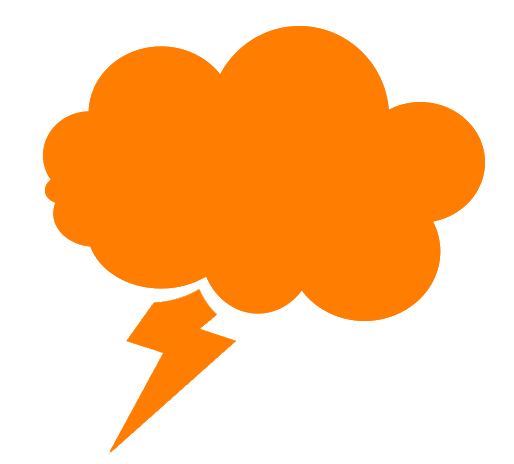

<!DOCTYPE html>
<html lang="en">
<head>
  <title>Home</title>
  <meta charset="utf-8">
  <meta name="viewport" content="width=device-width,initial-scale=1,maximum-scale=1,user-scalable=no">

<meta http-equiv="X-UA-Compatible" content="IE=edge,chrome=1">

<meta name="HandheldFriendly" content="true">
    
     <link rel="stylesheet" href="project-home.css">          
     <link rel="stylesheet" href="black&white-home.css">
     <link rel="stylesheet" href="hover-button-home.css">
     <link rel="stylesheet" href="animate-home.css">
     <link rel="stylesheet" href="demo-home.css">  
     <link rel="stylesheet" href="worm-text-home.css">
     <link rel="stylesheet" href="border-button-home.css">    
    
    
     <link href="https://maxcdn.bootstrapcdn.com/font-awesome/4.1.0/css/font-awesome.min.css" rel="stylesheet">
    
    
   </head>
<body>
    
     
    <nav class="tab"> 
   <ul class="list">     
  
  <li class="button-dropdown"><a href="carrossel.html" class="dropdown-toggle">Courses</a> </li>       
  
  <li class="button-dropdown"><a href="accordion.html" class="dropdown-toggle">Goals</a> </li>
       
    <li class="button-dropdown"><a href="slider.html" class="dropdown-toggle">Team</a></li>  

    <li>
      

        
     <a href="moving-com-contact.html">  
Contact
 </a>
    
 
    </li>    
       
    <svg width="500" height="500" viewBox="0 0 500 500">
  <!-- Symbol-->
  <symbol id="s-text">
    <text x="140" y="50" width="1000px" height="500px">SoftUni</text>
  </symbol>
  <!-- Duplicate symbols-->
  <use class="text" xlink:href="#s-text"></use>
  <use class="text" xlink:href="#s-text"></use>
  <use class="text" xlink:href="#s-text"></use>
  <use class="text" xlink:href="#s-text"></use>
  <use class="text" xlink:href="#s-text"></use>
</svg>
              
<li class="name">The place to be</li>    
</ul>     
        
        
        
 </nav>
    
      <header class="head"></header>     
      
    <main class="hello">
        
     
        
    

	
        
		
             
     <h1 class="uni">Software University marks your path to success</h1>   
       
		
  Become a part of the most successful IT academy in Bulgaria. Learn from the best in the realm of high-tech technology.
       
      
        
	

        

    
    </main>
    
    
      
  <footer class="down">
   <section class="contain">  
  <button data-hover="stay connected!" class="btn-social">
Find Us
</button> 
</section>
      
      
 

  <a href="https://bg-bg.facebook.com/SoftwareUniversity/" title="Facebook" target="_blank"><i class="fa fa-facebook"></i></a>
  <a href="https://twitter.com/softunibg?lang=bg" title="Twitter" target="_blank"><i class="fa fa-twitter"></i></a>
  <a href="https://github.com/SoftUni" title="GitHub" target="_blank"><i class="fa fa-github"></i></a>  

      
      
   

       
       
      

       
  <ul class="tabs">
      
      <li> <section class="buttons">  
       
    <a href="home.html" class="btn btn-2">Home</a> 
 

</section>   
 </li>
       
  <li> <section class="buttons">  
       
    <a href="carrossel.html" class="btn btn-2">Courses</a> 
 

</section>   
 </li>       
       
  <li> <section class="buttons">  
       
    <a href="accordion.html" class="btn btn-2">Goals</a> 
 

</section>   
 </li>
       
   <li> <section class="buttons">  
       
    <a href="slider.html" class="btn btn-2">Team</a> 
 

</section>   
 </li>       
       
   <li> <section class="buttons">  
       
    <a href="moving-com-contact.html" class="btn btn-2">Contact</a> 
 

</section>   
 </li>
       
   </ul>     
    
         
    </footer>    
      
      
  
 
             
              
   
      
    </body>
</html>
